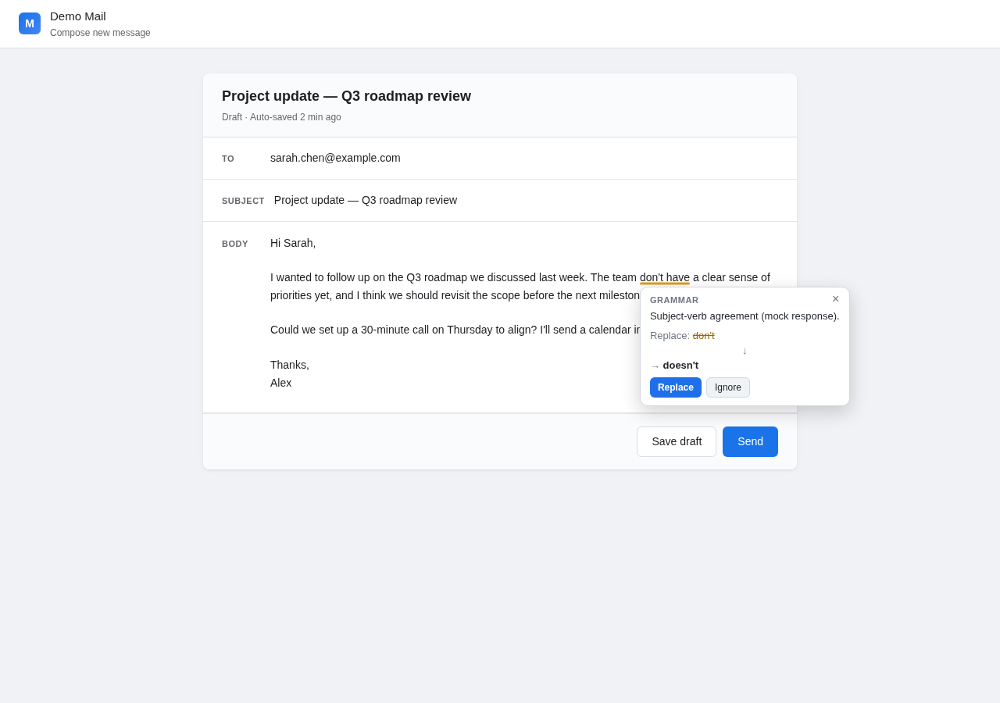
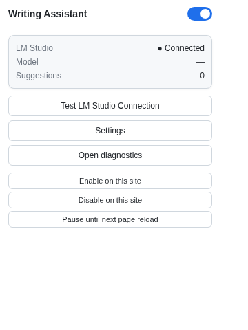
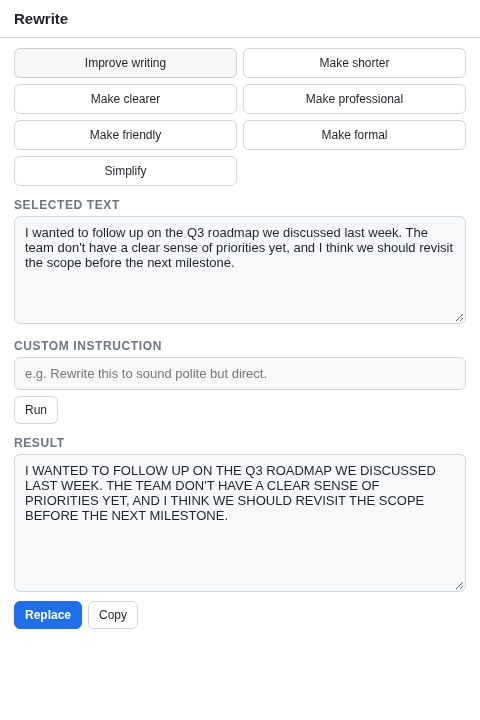

# Local Writing Assistant

[](https://github.com/kimpearce888/local-writing-assistant/actions/workflows/ci.yml)
[](#testing)
[](https://github.com/kimpearce888/local-writing-assistant/releases)
[](https://github.com/kimpearce888/local-writing-assistant/releases/tag/v1.4.0)
[](LICENSE)
[](PRIVACY.md)

A **fully local** AI writing assistant for Chrome on Windows, powered by [LM Studio](https://lmstudio.ai).

Your text never leaves your computer. No cloud AI, no telemetry, no account. The only engine is LM Studio running on your own machine — the architecture makes the privacy promise unbreakable by construction.

<p align="center">
  
</p>

> **v1.4.0** — one-click install now auto-bootstraps LM Studio. [See what's new →](#whats-new)

---

## Why this exists

Cloud-AI writing assistants have three problems: **privacy** (your draft cover letter leaves your machine), **cost** (subscription or your data), and **offline** (no internet = dead toolbar). This project runs the LLM locally via [LM Studio](https://lmstudio.ai) and exposes it through a Chrome extension that watches the page for editors and offers Grammarly-style inline suggestions plus a rewrite side panel. Not a Grammarly clone — an original local-first design.

---

## What it does

* Grammar · spelling · punctuation · clarity · word-choice checking
* Tone transformation: Professional, Friendly, Formal, Casual, Concise, Confident, Neutral
* Rewrite operations: Improve · Shorter · Clearer · Professional · Friendly · Formal · Simplify · Custom
* Inline suggestions with stale-result protection
* Side panel for selection-based rewrites
* Custom dictionary, per-site exclusions, per-site pause
* Diagnostics tool, light/dark mode, settings import/export

<table>
  <tr>
    <td width="50%" align="center" valign="top">
      <br/>
      <sub><b>Popup</b> — connection status, model, suggestion count, per-site controls</sub>
    </td>
    <td width="50%" align="center" valign="top">
      <br/>
      <sub><b>Side panel</b> — rewrite the selection: improve, shorter, professional, custom…</sub>
    </td>
  </tr>
</table>

---

## Install (one-click)

1. **Extract** `Local-Writing-Assistant-Windows.zip` anywhere.
2. **Double-click** `Install.bat`. Done.

The installer handles everything in a single run:

- Installs the native host EXE + registers it in the registry
- Copies the extension files to `%LOCALAPPDATA%\LocalWritingAssistant\extension`
- **Detects / downloads / silent-installs / launches LM Studio**
- **Starts the LM Studio server on port 1234** via the `lms` CLI
- Opens LM Studio's GUI with clear instructions if no model is loaded yet

**The one unavoidable manual step:** if no model is loaded, the installer opens LM Studio at the model browser and prints a 6-step walkthrough. You click **Download** on a chat-capable model (e.g. **Qwen2.5 7B Instruct**), wait for the multi-GB download, then click **Start Server**. License acceptance + size + model choice = inherently a human decision.

### Chrome extension loading

- **Enterprise Chrome (Mode A):** silently force-installed via `ExtensionInstallForcelist` pointing at our GitHub Pages `update.xml`. Zero manual steps.
- **Personal Chrome (Mode B):** Chrome refuses to silently install off-store extensions. The installer prints clear instructions for a one-time `Load unpacked` step (Developer mode ON → select the extension folder).

> **Advanced users** who already have LM Studio set up: pass `-SkipLMStudio` to `install.ps1`.

---

## Keyboard shortcuts

| Shortcut | Action |
|---|---|
| `Alt+Shift+L` | Check writing in the focused editor |
| `Alt+Shift+R` | Open the rewrite side panel for the current selection |
| `Alt+Shift+O` | Open the popup |

Remappable in `chrome://extensions/shortcuts`. Right-click selected text anywhere for **Improve writing · Make shorter · Make professional · Rewrite…**.

---

## Architecture

```
WEB PAGE  →  CONTENT SCRIPT  →  SERVICE WORKER  →  NATIVE MESSAGING  →  GO HOST EXE  →  LM STUDIO  →  LOCAL LLM
                                                              (127.0.0.1:1234 only)
```

Four layers, each a separate security boundary. The Go host accepts only 6 known commands (`ping`, `get_config`, `get_models`, `check_connection`, `grammar_check`, `rewrite`), exposes no shell/exec capability, and its custom HTTP dialer refuses any non-loopback destination — even a misconfigured URL can't escape the local machine.

Full details: [`PRIVACY.md`](PRIVACY.md) · [`SECURITY.md`](SECURITY.md) · [`DEVELOPMENT.md`](DEVELOPMENT.md). The full options page (dictionary, site exclusions, diagnostics, LM Studio config) is shown in [`docs/screenshots/options-page.png`](docs/screenshots/options-page.png).

---

## What's new

### v1.4.0 — one-click install

The installer now bootstraps LM Studio automatically. **Detect → download → silent-install → launch → start server** — a fresh Windows machine goes from "extract ZIP" to "extension running with a model loaded" with one double-click. Model download remains the only manual step (license + size + user choice).

### v1.3.0 — second-pass audit fixes

Switching tabs in the side panel no longer sends rewrites to the wrong tab. Mode A self-hosting fixed (codebase URL was circular). BOM-less UTF-8 writes (PS 5.1 + Go JSON compat). ResizeObserver on the editor catches layout shifts. Custom rewrite operation prompt-injection-hardened.

### v1.2.0 — production-readiness audit

First from-scratch neutral audit fixed 8 BLOCKERs across the codebase: side-panel Replace (always errored), pause-site feature (was no-op), overlay scroll drift, contenteditable offset mismatch, listener leaks, installer wiping `ExtensionInstallForcelist`, `.bat` exit codes always 0, missing LICENSE in ZIP.

See [`CHANGELOG.md`](CHANGELOG.md) for full history.

---

## Development

```bash
npm install && cd extension && npm install
npm run build:extension    # two-pass Vite build (SW module + IIFE content.js)
npm run build:native      # Go cross-compile to Windows EXE
npm test                  # all suites
```

| Suite | What it covers | Count |
|---|---|---|
| Vitest | AI parser, text utils, stale-result protection, sensitive-field detection, prompts | 37 |
| Go unit | Native-messaging protocol, security allowlists, payload clamps | 4 |
| Go integration | Wire-protocol round-trip against built host binary, mock-AI mode | 9 |
| Playwright E2E | Real Chrome + mock AI: popup, textarea, contenteditable, replace, password skip, prompt-injection safety, ignore, scroll, side-panel, pause-site | 10 |

All run on every push/PR via GitHub Actions. The E2E suite uses `LOCAL_MOCK_AI=true` so it runs without a real LM Studio — fully reproducible in CI.

---

## Troubleshooting

Run `Diagnose.bat` from the install folder. It prints a PASS/WARN/FAIL report covering Chrome, native host, registry, extension folder, LM Studio reachability, and loaded models. If any FAIL appears, run `Install.bat` again — it's idempotent and will repair.

---

## Contributing & License

Pull requests welcome — see [`CONTRIBUTING.md`](CONTRIBUTING.md). Every change must keep the assistant fully local (no cloud, no telemetry). For security vulnerabilities, follow the [security policy](https://github.com/kimpearce888/local-writing-assistant/security/policy) — do **not** open a public issue.

Released under the MIT License — see [`LICENSE`](LICENSE).
